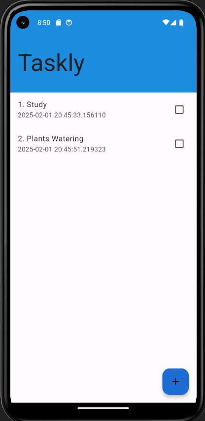
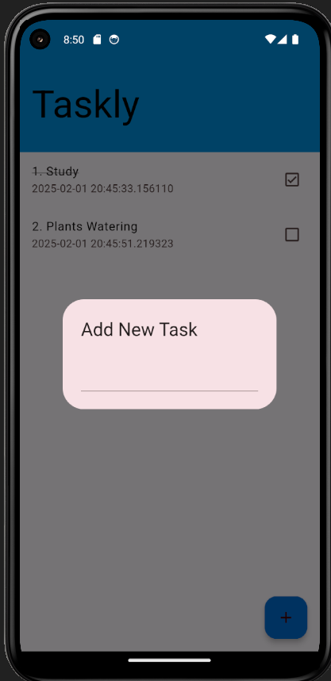

# Taskly

**Taskly** is a simple task management app built with Flutter. It allows users to add, view, mark tasks as done, and delete them. The app utilizes Hive for local storage to persist tasks between app launches.

## Features

- Add new tasks
- Mark tasks as done (with strikethrough text)
- Delete tasks on long press
- Persistent storage using Hive

## Packages Used

- `hive: ^2.2.3`: A lightweight and fast key-value database for Flutter
- `hive_flutter: ^1.1.0`: Hive package for Flutter integration

## Screenshots

Here are a couple of screenshots showcasing the app:

### Taskly Home Screen



### Add New Task Dialog




## Getting Started

### Prerequisites

Make sure you have Flutter installed on your machine. You can check the installation guide on the [official Flutter website](https://flutter.dev/docs/get-started/install).

### Installation

1. Clone the repository:
   ```bash
   git clone https://github.com/akashpd390/Taskly.git
   ```
   
2. Navigate to the project directory:
   ```bash
   cd taskly
   ```

3. Install dependencies:
   ```bash
   flutter pub get
   ```

4. Run the app:
   ```bash
   flutter run
   ```

## Project Structure

```
lib/
├── main.dart          # Main entry point for the app
├── models/
│   └── task.dart      # Task model for managing task data
└── my_home_page.dart  # The main home page with task management UI
```

## Hive Setup

In this app, we are using Hive for local storage. It is configured to store tasks and their state (done or not). The tasks are persisted and can be retrieved after the app is closed and reopened.

### Hive Dependencies

In the `pubspec.yaml` file, we are using the following dependencies:

```yaml
dependencies:
  flutter:
    sdk: flutter
  hive: ^2.2.3
  hive_flutter: ^1.1.0
```

## Contributing

Feel free to fork the repository and submit pull requests. Contributions are welcome!
